# AFNε da ER-01: Identificação do boletim

> Arquivo gerado por `python -m decodmetar.afne.diagramas`. Não edite à mão:
> altere `decodmetar/afne/definicoes.py` e gere de novo.

Padrão no código: `(METAR|SPECI) (COR )?S[BDINSW][A-Z]{2}`

- Estados: 22 (q0, q1, q2, q3, q4, q5, q6, q7, q8, q9, q10, q11, q12, q13, q14, q15, q16, q17, q18, q19, q20, q21)
- Estado inicial: q0
- Estados finais: q21
- Movimentos vazios (ε): q5 → q11, q10 → q11, q12 → q17, q16 → q17

Legenda: setas tracejadas são movimentos ε; círculo duplo é estado final.
Rótulos como `[0-9]` são classes finitas, abreviação da união dos símbolos
(ex.: `[0-2]` = `0 | 1 | 2`). O símbolo `␣` representa o espaço.

```mermaid
flowchart LR
    classDef oculto fill:none,stroke:none,color:none
    inicio[" "]:::oculto --> q0
    q0(("q0"))
    q1(("q1"))
    q2(("q2"))
    q3(("q3"))
    q4(("q4"))
    q5(("q5"))
    q6(("q6"))
    q7(("q7"))
    q8(("q8"))
    q9(("q9"))
    q10(("q10"))
    q11(("q11"))
    q12(("q12"))
    q13(("q13"))
    q14(("q14"))
    q15(("q15"))
    q16(("q16"))
    q17(("q17"))
    q18(("q18"))
    q19(("q19"))
    q20(("q20"))
    q21((("q21")))
    q0 -->|"M"| q1
    q0 -->|"S"| q6
    q1 -->|"E"| q2
    q2 -->|"T"| q3
    q3 -->|"A"| q4
    q4 -->|"R"| q5
    q5 -.->|"ε"| q11
    q6 -->|"P"| q7
    q7 -->|"E"| q8
    q8 -->|"C"| q9
    q9 -->|"I"| q10
    q10 -.->|"ε"| q11
    q11 -->|"␣"| q12
    q12 -->|"C"| q13
    q12 -.->|"ε"| q17
    q13 -->|"O"| q14
    q14 -->|"R"| q15
    q15 -->|"␣"| q16
    q16 -.->|"ε"| q17
    q17 -->|"S"| q18
    q18 -->|"[BDINSW]"| q19
    q19 -->|"[A-Z]"| q20
    q20 -->|"[A-Z]"| q21
```

O mesmo diagrama em imagem: [`ER01.svg`](ER01.svg) (exportada do Mermaid acima).

## Tabela de transições

`→` marca o estado inicial e `*` os estados finais.

| Estado | Símbolo | Destino |
|---|---|---|
| → q0 | `M` | q1 |
| → q0 | `S` | q6 |
| q1 | `E` | q2 |
| q2 | `T` | q3 |
| q3 | `A` | q4 |
| q4 | `R` | q5 |
| q5 | `ε` | q11 |
| q6 | `P` | q7 |
| q7 | `E` | q8 |
| q8 | `C` | q9 |
| q9 | `I` | q10 |
| q10 | `ε` | q11 |
| q11 | `␣` | q12 |
| q12 | `C` | q13 |
| q12 | `ε` | q17 |
| q13 | `O` | q14 |
| q14 | `R` | q15 |
| q15 | `␣` | q16 |
| q16 | `ε` | q17 |
| q17 | `S` | q18 |
| q18 | `[BDINSW]` | q19 |
| q19 | `[A-Z]` | q20 |
| q20 | `[A-Z]` | q21 |
