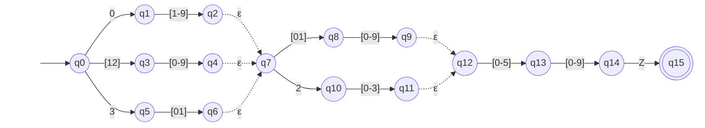

# AFNε da ER-02: Data e hora da observação

> Arquivo gerado por `python -m decodmetar.afne.diagramas`. Não edite à mão:
> altere `decodmetar/afne/definicoes.py` e gere de novo.

Padrão no código: `(0[1-9]|[12][0-9]|3[01])([01][0-9]|2[0-3])[0-5][0-9]Z`

- Estados: 16 (q0, q1, q2, q3, q4, q5, q6, q7, q8, q9, q10, q11, q12, q13, q14, q15)
- Estado inicial: q0
- Estados finais: q15
- Movimentos vazios (ε): q2 → q7, q4 → q7, q6 → q7, q9 → q12, q11 → q12

Legenda: setas tracejadas são movimentos ε; círculo duplo é estado final.
Rótulos como `[0-9]` são classes finitas, abreviação da união dos símbolos
(ex.: `[0-2]` = `0 | 1 | 2`). O símbolo `␣` representa o espaço.

O mesmo diagrama em imagem: [`ER02.svg`](ER02.svg) (exportada do Mermaid acima).

## Tabela de transições

`→` marca o estado inicial e `*` os estados finais.

| Estado | Símbolo | Destino |
|---|---|---|
| → q0 | `0` | q1 |
| → q0 | `[12]` | q3 |
| → q0 | `3` | q5 |
| q1 | `[1-9]` | q2 |
| q2 | `ε` | q7 |
| q3 | `[0-9]` | q4 |
| q4 | `ε` | q7 |
| q5 | `[01]` | q6 |
| q6 | `ε` | q7 |
| q7 | `[01]` | q8 |
| q7 | `2` | q10 |
| q8 | `[0-9]` | q9 |
| q9 | `ε` | q12 |
| q10 | `[0-3]` | q11 |
| q11 | `ε` | q12 |
| q12 | `[0-5]` | q13 |
| q13 | `[0-9]` | q14 |
| q14 | `Z` | q15 |
