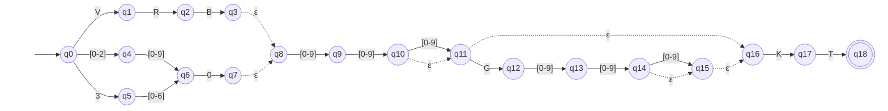

# AFNε da ER-03: Vento de superfície

> Arquivo gerado por `python -m decodmetar.afne.diagramas`. Não edite à mão:
> altere `decodmetar/afne/definicoes.py` e gere de novo.

Padrão no código: `(VRB|([0-2][0-9]|3[0-6])0)[0-9]{2,3}(G[0-9]{2,3})?KT`

- Estados: 19 (q0, q1, q2, q3, q4, q5, q6, q7, q8, q9, q10, q11, q12, q13, q14, q15, q16, q17, q18)
- Estado inicial: q0
- Estados finais: q18
- Movimentos vazios (ε): q3 → q8, q7 → q8, q10 → q11, q11 → q16, q14 → q15, q15 → q16

Legenda: setas tracejadas são movimentos ε; círculo duplo é estado final.
Rótulos como `[0-9]` são classes finitas, abreviação da união dos símbolos
(ex.: `[0-2]` = `0 | 1 | 2`).

## Tabela de transições

`→` marca o estado inicial e `*` os estados finais.

| Estado | Símbolo | Destino |
|---|---|---|
| → q0 | `V` | q1 |
| → q0 | `[0-2]` | q4 |
| → q0 | `3` | q5 |
| q1 | `R` | q2 |
| q2 | `B` | q3 |
| q3 | `ε` | q8 |
| q4 | `[0-9]` | q6 |
| q5 | `[0-6]` | q6 |
| q6 | `0` | q7 |
| q7 | `ε` | q8 |
| q8 | `[0-9]` | q9 |
| q9 | `[0-9]` | q10 |
| q10 | `[0-9]` | q11 |
| q10 | `ε` | q11 |
| q11 | `G` | q12 |
| q11 | `ε` | q16 |
| q12 | `[0-9]` | q13 |
| q13 | `[0-9]` | q14 |
| q14 | `[0-9]` | q15 |
| q14 | `ε` | q15 |
| q15 | `ε` | q16 |
| q16 | `K` | q17 |
| q17 | `T` | q18 |
