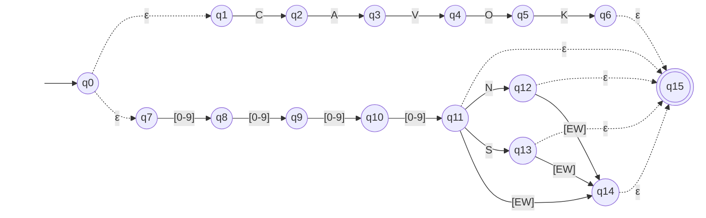

# AFNε da ER-04: Visibilidade predominante

> Arquivo gerado por `python -m decodmetar.afne.diagramas`. Não edite à mão:
> altere `decodmetar/afne/definicoes.py` e gere de novo.

Padrão no código: `CAVOK|[0-9]{4}(N|NE|E|SE|S|SW|W|NW)?`

- Estados: 16 (q0, q1, q2, q3, q4, q5, q6, q7, q8, q9, q10, q11, q12, q13, q14, q15)
- Estado inicial: q0
- Estados finais: q15
- Movimentos vazios (ε): q0 → q1, q0 → q7, q6 → q15, q11 → q15, q12 → q15, q13 → q15, q14 → q15

Legenda: setas tracejadas são movimentos ε; círculo duplo é estado final.
Rótulos como `[0-9]` são classes finitas, abreviação da união dos símbolos
(ex.: `[0-2]` = `0 | 1 | 2`).

## Tabela de transições

`→` marca o estado inicial e `*` os estados finais.

| Estado | Símbolo | Destino |
|---|---|---|
| → q0 | `ε` | q1 |
| → q0 | `ε` | q7 |
| q1 | `C` | q2 |
| q2 | `A` | q3 |
| q3 | `V` | q4 |
| q4 | `O` | q5 |
| q5 | `K` | q6 |
| q6 | `ε` | q15 |
| q7 | `[0-9]` | q8 |
| q8 | `[0-9]` | q9 |
| q9 | `[0-9]` | q10 |
| q10 | `[0-9]` | q11 |
| q11 | `ε` | q15 |
| q11 | `N` | q12 |
| q11 | `S` | q13 |
| q11 | `[EW]` | q14 |
| q12 | `ε` | q15 |
| q12 | `[EW]` | q14 |
| q13 | `ε` | q15 |
| q13 | `[EW]` | q14 |
| q14 | `ε` | q15 |
