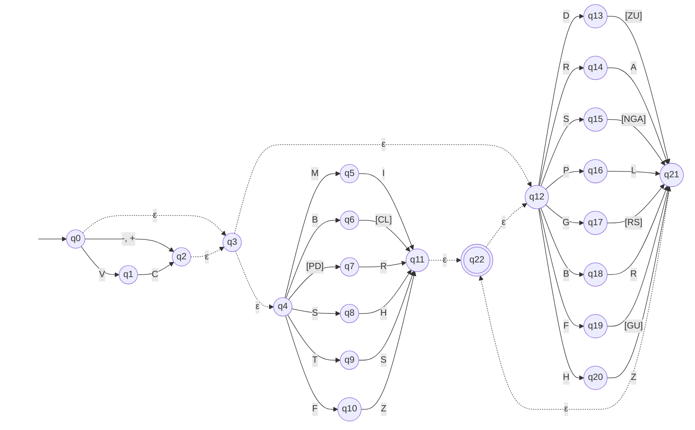

# AFNε da ER-05: Tempo presente

> Arquivo gerado por `python -m decodmetar.afne.diagramas`. Não edite à mão:
> altere `decodmetar/afne/definicoes.py` e gere de novo.

Padrão no código: `(-|\+|VC)?((MI|BC|PR|DR|BL|SH|TS|FZ)(DZ|RA|SN|SG|PL|GR|GS|BR|FG|FU|HZ|DU|SA)*|(DZ|RA|SN|SG|PL|GR|GS|BR|FG|FU|HZ|DU|SA)+)`

- Estados: 23 (q0, q1, q2, q3, q4, q5, q6, q7, q8, q9, q10, q11, q12, q13, q14, q15, q16, q17, q18, q19, q20, q21, q22)
- Estado inicial: q0
- Estados finais: q22
- Movimentos vazios (ε): q0 → q3, q2 → q3, q3 → q4, q3 → q12, q11 → q22, q21 → q22, q22 → q12

Legenda: setas tracejadas são movimentos ε; círculo duplo é estado final.
Rótulos como `[0-9]` são classes finitas, abreviação da união dos símbolos
(ex.: `[0-2]` = `0 | 1 | 2`). O símbolo `␣` representa o espaço.

O mesmo diagrama em imagem: [`ER05.svg`](ER05.svg) (exportada do Mermaid acima).

## Tabela de transições

`→` marca o estado inicial e `*` os estados finais.

| Estado | Símbolo | Destino |
|---|---|---|
| → q0 | `-` | q2 |
| → q0 | `+` | q2 |
| → q0 | `V` | q1 |
| → q0 | `ε` | q3 |
| q1 | `C` | q2 |
| q2 | `ε` | q3 |
| q3 | `ε` | q4 |
| q3 | `ε` | q12 |
| q4 | `M` | q5 |
| q4 | `B` | q6 |
| q4 | `[PD]` | q7 |
| q4 | `S` | q8 |
| q4 | `T` | q9 |
| q4 | `F` | q10 |
| q5 | `I` | q11 |
| q6 | `[CL]` | q11 |
| q7 | `R` | q11 |
| q8 | `H` | q11 |
| q9 | `S` | q11 |
| q10 | `Z` | q11 |
| q11 | `ε` | q22 |
| q12 | `D` | q13 |
| q12 | `R` | q14 |
| q12 | `S` | q15 |
| q12 | `P` | q16 |
| q12 | `G` | q17 |
| q12 | `B` | q18 |
| q12 | `F` | q19 |
| q12 | `H` | q20 |
| q13 | `[ZU]` | q21 |
| q14 | `A` | q21 |
| q15 | `[NGA]` | q21 |
| q16 | `L` | q21 |
| q17 | `[RS]` | q21 |
| q18 | `R` | q21 |
| q19 | `[GU]` | q21 |
| q20 | `Z` | q21 |
| q21 | `ε` | q22 |
| * q22 | `ε` | q12 |
