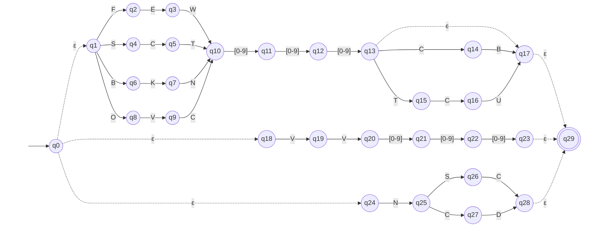

# AFNε da ER-06: Camada de nuvens

> Arquivo gerado por `python -m decodmetar.afne.diagramas`. Não edite à mão:
> altere `decodmetar/afne/definicoes.py` e gere de novo.

Padrão no código: `(FEW|SCT|BKN|OVC)[0-9]{3}(CB|TCU)?|VV[0-9]{3}|NSC|NCD`

- Estados: 30 (q0, q1, q2, q3, q4, q5, q6, q7, q8, q9, q10, q11, q12, q13, q14, q15, q16, q17, q18, q19, q20, q21, q22, q23, q24, q25, q26, q27, q28, q29)
- Estado inicial: q0
- Estados finais: q29
- Movimentos vazios (ε): q0 → q1, q0 → q18, q0 → q24, q13 → q17, q17 → q29, q23 → q29, q28 → q29

Legenda: setas tracejadas são movimentos ε; círculo duplo é estado final.
Rótulos como `[0-9]` são classes finitas, abreviação da união dos símbolos
(ex.: `[0-2]` = `0 | 1 | 2`). O símbolo `␣` representa o espaço.

O mesmo diagrama em imagem: [`ER06.svg`](ER06.svg) (exportada do Mermaid acima).

## Tabela de transições

`→` marca o estado inicial e `*` os estados finais.

| Estado | Símbolo | Destino |
|---|---|---|
| → q0 | `ε` | q1 |
| → q0 | `ε` | q18 |
| → q0 | `ε` | q24 |
| q1 | `F` | q2 |
| q1 | `S` | q4 |
| q1 | `B` | q6 |
| q1 | `O` | q8 |
| q2 | `E` | q3 |
| q3 | `W` | q10 |
| q4 | `C` | q5 |
| q5 | `T` | q10 |
| q6 | `K` | q7 |
| q7 | `N` | q10 |
| q8 | `V` | q9 |
| q9 | `C` | q10 |
| q10 | `[0-9]` | q11 |
| q11 | `[0-9]` | q12 |
| q12 | `[0-9]` | q13 |
| q13 | `C` | q14 |
| q13 | `T` | q15 |
| q13 | `ε` | q17 |
| q14 | `B` | q17 |
| q15 | `C` | q16 |
| q16 | `U` | q17 |
| q17 | `ε` | q29 |
| q18 | `V` | q19 |
| q19 | `V` | q20 |
| q20 | `[0-9]` | q21 |
| q21 | `[0-9]` | q22 |
| q22 | `[0-9]` | q23 |
| q23 | `ε` | q29 |
| q24 | `N` | q25 |
| q25 | `S` | q26 |
| q25 | `C` | q27 |
| q26 | `C` | q28 |
| q27 | `D` | q28 |
| q28 | `ε` | q29 |
