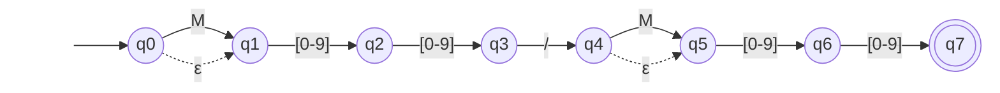

# AFNε da ER-07: Temperatura e ponto de orvalho

> Arquivo gerado por `python -m decodmetar.afne.diagramas`. Não edite à mão:
> altere `decodmetar/afne/definicoes.py` e gere de novo.

Padrão no código: `M?[0-9]{2}/M?[0-9]{2}`

- Estados: 8 (q0, q1, q2, q3, q4, q5, q6, q7)
- Estado inicial: q0
- Estados finais: q7
- Movimentos vazios (ε): q0 → q1, q4 → q5

Legenda: setas tracejadas são movimentos ε; círculo duplo é estado final.
Rótulos como `[0-9]` são classes finitas, abreviação da união dos símbolos
(ex.: `[0-2]` = `0 | 1 | 2`). O símbolo `␣` representa o espaço.

O mesmo diagrama em imagem: [`ER07.svg`](ER07.svg) (exportada do Mermaid acima).

## Tabela de transições

`→` marca o estado inicial e `*` os estados finais.

| Estado | Símbolo | Destino |
|---|---|---|
| → q0 | `M` | q1 |
| → q0 | `ε` | q1 |
| q1 | `[0-9]` | q2 |
| q2 | `[0-9]` | q3 |
| q3 | `/` | q4 |
| q4 | `M` | q5 |
| q4 | `ε` | q5 |
| q5 | `[0-9]` | q6 |
| q6 | `[0-9]` | q7 |
