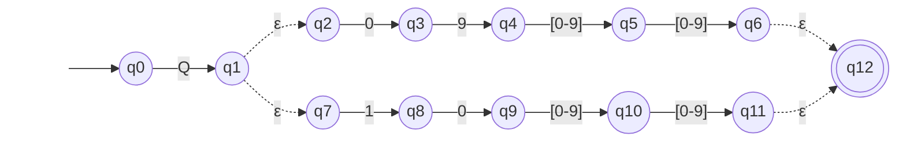

# AFNε da ER-08: Pressão QNH

> Arquivo gerado por `python -m decodmetar.afne.diagramas`. Não edite à mão:
> altere `decodmetar/afne/definicoes.py` e gere de novo.

Padrão no código: `Q(09[0-9]{2}|10[0-9]{2})`

- Estados: 13 (q0, q1, q2, q3, q4, q5, q6, q7, q8, q9, q10, q11, q12)
- Estado inicial: q0
- Estados finais: q12
- Movimentos vazios (ε): q1 → q2, q1 → q7, q6 → q12, q11 → q12

Legenda: setas tracejadas são movimentos ε; círculo duplo é estado final.
Rótulos como `[0-9]` são classes finitas, abreviação da união dos símbolos
(ex.: `[0-2]` = `0 | 1 | 2`). O símbolo `␣` representa o espaço.

O mesmo diagrama em imagem: [`ER08.svg`](ER08.svg) (exportada do Mermaid acima).

## Tabela de transições

`→` marca o estado inicial e `*` os estados finais.

| Estado | Símbolo | Destino |
|---|---|---|
| → q0 | `Q` | q1 |
| q1 | `ε` | q2 |
| q1 | `ε` | q7 |
| q2 | `0` | q3 |
| q3 | `9` | q4 |
| q4 | `[0-9]` | q5 |
| q5 | `[0-9]` | q6 |
| q6 | `ε` | q12 |
| q7 | `1` | q8 |
| q8 | `0` | q9 |
| q9 | `[0-9]` | q10 |
| q10 | `[0-9]` | q11 |
| q11 | `ε` | q12 |
